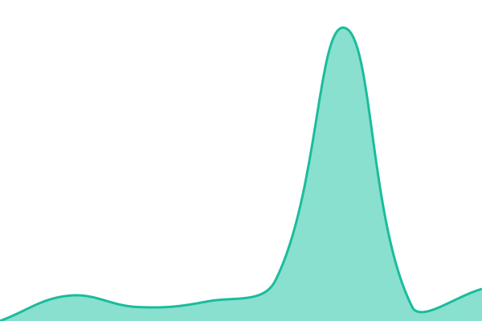
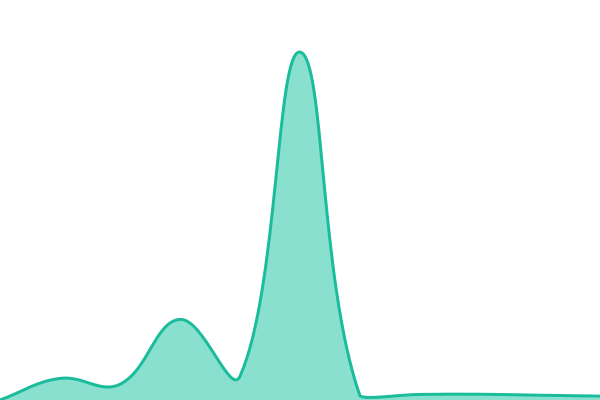
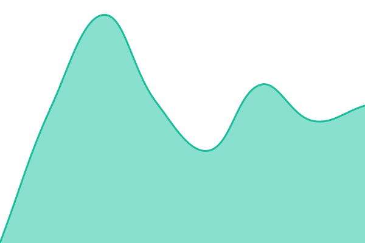
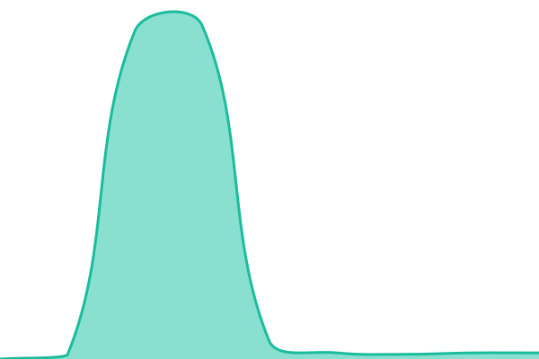
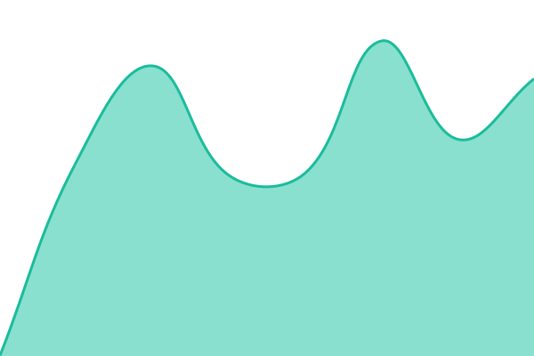
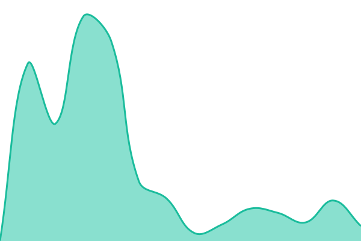
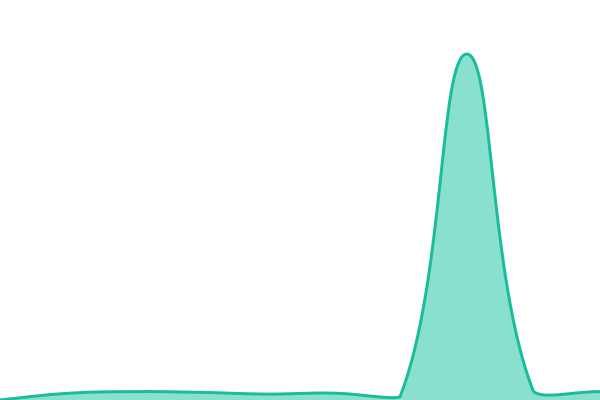

# [📈 Live Status](https://status.skica.dev): <!--live status--> **🟧 Partial outage**

This repository contains the open-source uptime monitor and status page for [Maksymilian Skica](https://skica.dev), powered by [Upptime](https://github.com/upptime/upptime).

With [Upptime](https://upptime.js.org), you can get your own unlimited and free uptime monitor and status page, powered entirely by a GitHub repository. We use [Issues](https://github.com/skica-dev/status/issues) as incident reports, [Actions](https://github.com/skica-dev/status/actions) as uptime monitors, and [Pages](https://status.skica.dev) for the status page.

<!--start: status pages-->
<!-- This summary is generated by Upptime (https://github.com/upptime/upptime) -->
<!-- Do not edit this manually, your changes will be overwritten -->
<!-- prettier-ignore -->
| URL | Status | History | Response Time | Uptime |
| --- | ------ | ------- | ------------- | ------ |
|  [skica.dev](https://skica.dev) | 🟩 Up | [skica-dev.yml](https://github.com/skica-dev/status/commits/HEAD/history/skica-dev.yml) | 

 316ms
     
 | 

<a href="https://status.skica.dev/history/skica-dev">100.00%</a>
    

|  [Pociągi](https://pociagi.skica.dev) | 🟥 Down | [pociagi.yml](https://github.com/skica-dev/status/commits/HEAD/history/pociagi.yml) | 

 4589ms
     
 | 

<a href="https://status.skica.dev/history/pociagi">99.80%</a>
    

|  [Nextcloud](https://cloud.skica.dev) | 🟥 Down | [nextcloud.yml](https://github.com/skica-dev/status/commits/HEAD/history/nextcloud.yml) | 

 5205ms
     
 | 

<a href="https://status.skica.dev/history/nextcloud">99.81%</a>
    

|  [Change detection](https://changes.skica.dev) | 🟥 Down | [change-detection.yml](https://github.com/skica-dev/status/commits/HEAD/history/change-detection.yml) | 

 4839ms
     
 | 

<a href="https://status.skica.dev/history/change-detection">99.83%</a>
    

|  [Todoist extension](https://todoist-gtd.rover.cap.skica.dev) | 🟥 Down | [todoist-extension.yml](https://github.com/skica-dev/status/commits/HEAD/history/todoist-extension.yml) | 

 4556ms
     
 | 

<a href="https://status.skica.dev/history/todoist-extension">99.85%</a>
    

|  [Caprover management](https://captain.rover.cap.skica.dev) | 🟥 Down | [caprover-management.yml](https://github.com/skica-dev/status/commits/HEAD/history/caprover-management.yml) | 

 0ms
     
 | 

<a href="https://status.skica.dev/history/caprover-management">0.00%</a>
    

|  [Podręczniki](https://podreczniki.info) | 🟥 Down | [podreczniki.yml](https://github.com/skica-dev/status/commits/HEAD/history/podreczniki.yml) | 

 0ms
     
 | 

<a href="https://status.skica.dev/history/podreczniki">0.00%</a>
    

|  [N8n](https://n8n.skica.dev) | 🟥 Down | [n8n.yml](https://github.com/skica-dev/status/commits/HEAD/history/n8n.yml) | 

 624ms
     
 | 

<a href="https://status.skica.dev/history/n8n">95.92%</a>
    

|  [Mailstack](https://mailstack.skica.dev) | 🟥 Down | [mailstack.yml](https://github.com/skica-dev/status/commits/HEAD/history/mailstack.yml) | 

 4489ms
     
 | 

<a href="https://status.skica.dev/history/mailstack">99.99%</a>
    

<!--end: status pages-->

[**Visit our status website →**](https://status.skica.dev)

## 📄 License

- Powered by: [Upptime](https://github.com/upptime/upptime)
- Code: [MIT](./LICENSE) © [Anand Chowdhary](https://anandchowdhary.com), supported by [Pabio](https://pabio.com)
- Data in the `./history` directory: [Open Database License](https://opendatacommons.org/licenses/odbl/1-0/)
